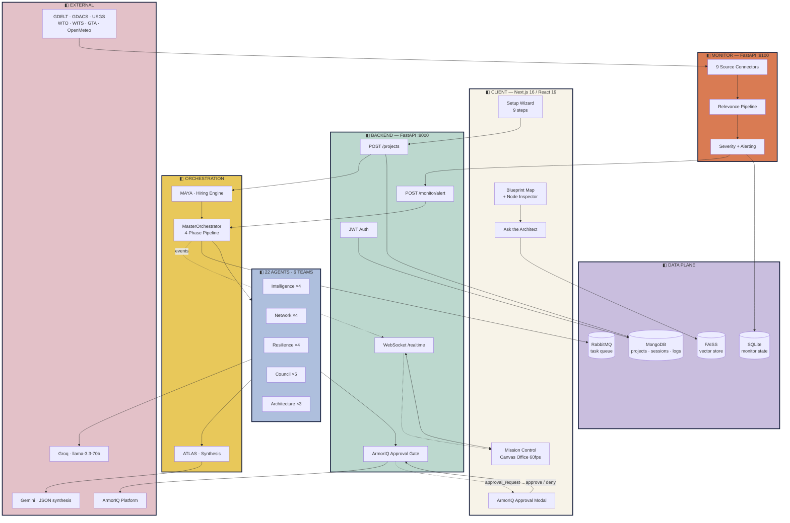
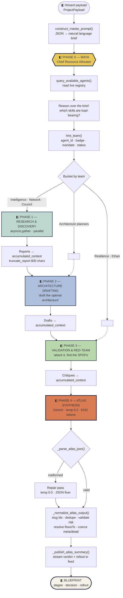
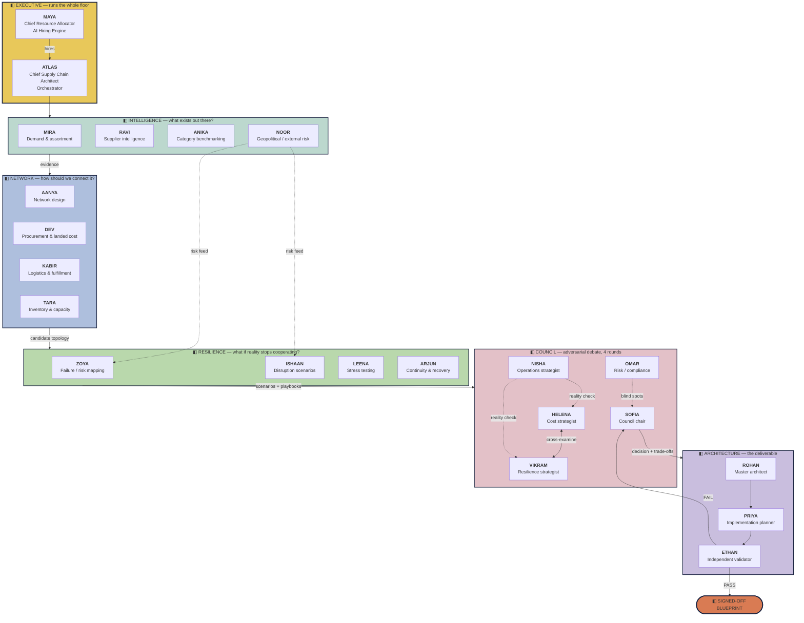
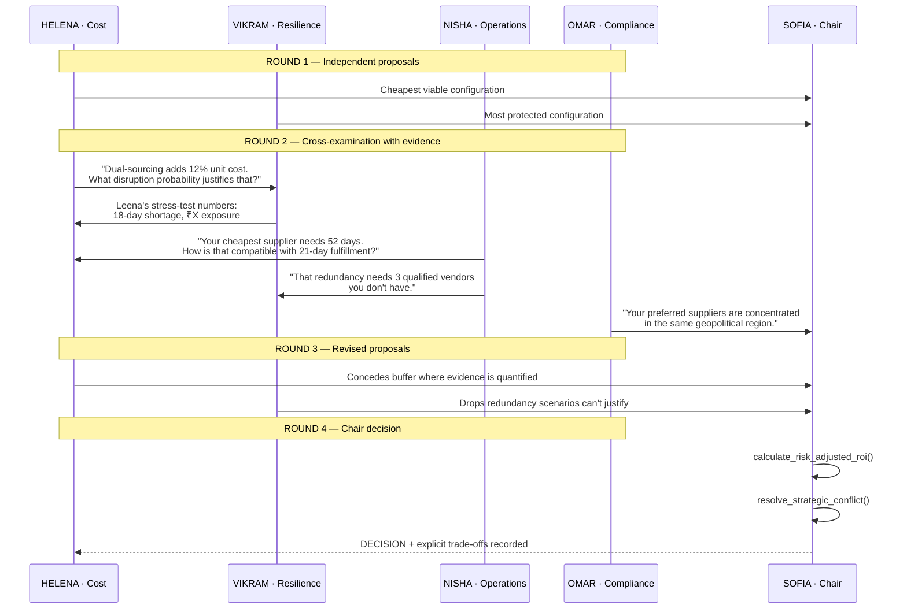
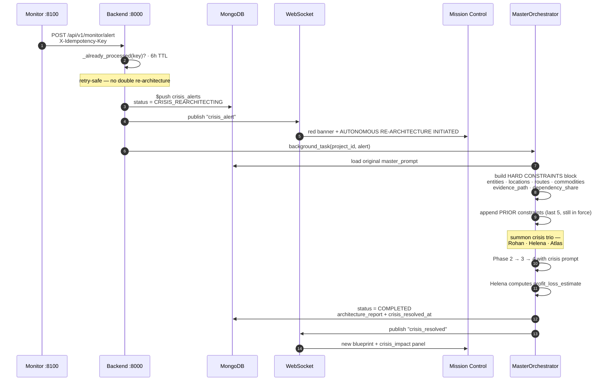
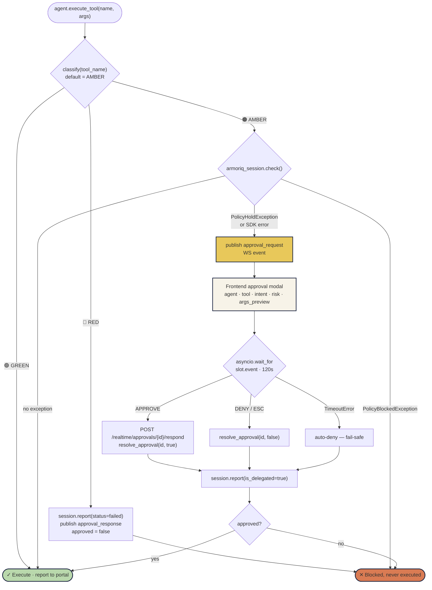

<div align="center">


<br/>


<br/>

**`> GIVE US A PRODUCT. WE BUILD THE SUPPLY CHAIN.`**

An autonomous AI organization of **22 specialist agents** across **6 teams** that researches,
designs, debates, stress-tests and continuously defends a complete supply network architecture —
a living network that reroutes itself around tariff shocks, blocked routes and supplier failure.

<br/>


<br/>

**TEAM: EVOLVE AI** · A solution by Evolve AI for the **AUTOMATE-INDIA Hackathon**

</div>

---

<div align="center">

### Table of Contents

[Concept](#-the-concept) ·
[Screens](#-the-product-end-to-end) ·
[Architecture](#-system-architecture) ·
[Pipeline](#-the-4-phase-execution-pipeline) ·
[Agents](#-the-workforce--22-agents--6-teams) ·
[Monitor](#-the-monitor--autonomous-crisis-response) ·
[ArmorIQ](#-armoriq--human-in-the-loop-security) ·
[Tech Stack](#-technology-stack) ·
[Getting Started](#-getting-started) ·
[API](#-api-surface) ·
[Repo Map](#-repository-map)

</div>

---

## ◧ The Concept

Traditional supply-chain software asks you to already know your supply chain. **Mycel inverts that.**

You describe a business — *"I'm a car spare-parts wholesaler serving a 150 km radius around Hisar"* — and an
entire AI organization wakes up, hires itself, researches the real world, argues internally about the
trade-offs, tries to break its own design, and hands you a fully specified network architecture with
every node, edge, cost, lead time, risk score and fallback path documented.

Then it **keeps watching**. When the USA raises a tariff on HS-8507, when GDACS reports a cyclone near
your warehouse corridor, when a supplier's country destabilises — the organization re-convenes and
re-architects the network autonomously.

<table>
<tr>
<td width="33%" valign="top">

**◨ It hires, not just runs**

Maya reads the brief and hires the *minimum viable task force*. A 22-agent org runs as a 4-agent
team when that's all the problem needs — saving time, cost and tokens.

</td>
<td width="33%" valign="top">

**◨ It disagrees with itself**

Four adversarial strategists debate across four rounds. Cost fights resilience, operations fights
fantasy, compliance hunts blind spots. The chair records the decision *with the trade-off*.

</td>
<td width="33%" valign="top">

**◨ It never fabricates**

Every claim is tagged `VERIFIED` / `ESTIMATED` / `UNKNOWN`. Ethan attacks the blueprint before
sign-off and can fail it back to the Council.

</td>
</tr>
</table>

---

## ◧ The Product, End to End

### 1 · Boot & Operator Authentication

The network is already running before you sign in — nine agents keep sourcing, pricing and
stress-testing around the clock. The boot log is live.

<div align="center">

</div>

```
> [DEV]   pricing landed cost across 3 sourcing lanes      OK
> [AANYA] plant capacity model → 140k units / yr            OK
> [NISHA] bottleneck watch armed at 71% utilization         OK
> [TARA]  safety stock solver → 30d central cover           ...
> [KABIR] priced 22 outbound lanes, 2 flagged               OK
> [MIRA]  demand clustered into 12 regions                  OK
```

Auth is JWT-based (`PyJWT` + `passlib`/`bcrypt`), issued by `POST /api/v1/auth/*`, and every
protected v1 router carries `Depends(get_current_user)`.

---

### 2 · The 9-Step Intake Wizard

Mycel refuses to interrogate you with 50 mandatory fields. The wizard is **progressive context
acquisition** — start with three questions, then *"we can produce a better architecture if you
provide any of the following…"*. Every step maps to a field on `ProjectPayload` and is compiled
into a natural-language master prompt by `construct_master_prompt()`.

<table>
<tr>
<td width="50%"></td>
<td width="50%"></td>
</tr>
<tr>
<td width="50%"></td>
<td width="50%"></td>
</tr>
<tr>
<td width="50%"></td>
<td width="50%"></td>
</tr>
<tr>
<td width="50%"></td>
<td width="50%"></td>
</tr>
</table>

| # | Step | Captures | Consumed by |
|:--|:--|:--|:--|
| **01** | What are you? | 6 business archetypes — product line, retail/ecommerce, multi-location retailer, wholesaler/distributor, multi-category, existing network | Maya (hiring shape), Anika (category norms) |
| **02** | What are you supplying? | Categories, brands, SKU count band (`<50` → `5,000+`), customer types | Mira, Ravi, Tara |
| **03** | Where? | Supply geography, operations/warehouse locations, customer scope (city → multi-country) | Aanya, Kabir, Noor |
| **04** | How much? | Volume band, demand pattern (stable / seasonal / variable / growing), peak surge multiple | Mira, Tara, Leena |
| **05** | By when? | Launch target + deadline hardness (immovable / strong / soft) | Priya (rollout sequencing) |
| **06** | At what cost? | Budget tolerance (cost-first → resilience) + acceptable freight modes | Dev, Helena, Rohan |
| **07** | What matters? | Drag-to-rank priority stack across 8 objectives | Sofia (council weighting) |
| **08** | What do we already know? | Existing suppliers, contracts, discounts, warehouses, manufacturing, logistics agreements, hard constraints | Every agent (grounding) |
| **09** | Upload your data | CSV / Excel / PDF — supplier lists, inventory reports, sales history, BOM, contracts, network diagrams | Knowledge ingestion → FAISS vector store |

**Step 9** ingests real documents through `core/document_parser.py` (PyMuPDF, `python-docx`,
`openpyxl`, `python-calamine`) into the chunk → embed → index pipeline under `knowledge/ingestion/`.

<div align="center">

</div>

---

### 3 · Inputs Received → Network Compiling

Before a single token is spent, Mycel echoes back exactly what it understood. This is the
brief that becomes the master prompt.

<div align="center">

</div>

---

### 4 · Mission Control — The Pixel Office Floor

The core of Mycel. A 60 fps HTML5-canvas top-down office where every hired agent is a real sprite
with pathfinding, desk assignment, cabin membership and live speech bubbles. Cabins are colour-coded
by team: **Research**, **Planning**, **Resilience**, **Strategy**, **Architecture**, and the
**Executive** cabin where Maya and Atlas sit.

Right of the floor is the **Command Center** with four tabs: `ATLAS` (orchestrator feed),
`HIRING`, `AGENTS` (live workforce status), `BLUEPRINT` (the deliverable).

<div align="center">

</div>

The **Atlas Orchestrator Feed** is not decoration — it is the live event stream published over
WebSockets by `core/events.py::event_publisher`, showing real tool invocations:

```
[330:00] >  Maya beginning architectural analysis...
[330:01] >  Maya utilizing: query_available_agents()
[330:05] >  Maya utilizing: hire_team()
[330:07] >  Maya finalized design. Output: The task force has been assembled
            and hired. The team now includes: Atlas (MYC-001-ATL), Rohan
            (MYC-002-ROH), Priya (MYC-003-PRI), Ethan (MYC-004-ETH), Helena
            (MYC-005-HEL), Nisha (MYC-006-NIS), Vikram (MYC-007-VIK), Kabir
            (MYC-008-KAB), Tara (MYC-009-TAR), Dev (MYC-010-DEV), Ravi
            (MYC-011-RAV) — exactly what's needed to deliver a resilient,
            scalable, low-cost solution for the car-spare-parts wholesaler.
```

---

### 5 · Live Workforce Status

Every agent reports `STANDBY` → `WORKING` → `DONE` with a per-agent mission clock. Agents that Maya
did **not** hire stay on standby and never consume a token.

<div align="center">

</div>

Status flows `BaseAgent.report_status()` → MongoDB (`agent_sessions`, `agent_logs`) →
`POST /api/v1/realtime/broadcast/{session_id}` → WebSocket → canvas sprite state.

---

### 6 · Team Directory & Agent Dossiers

Click any member of the org chart to open a full dossier: mission, responsibilities, MCP tools,
step-by-step workflow, and a sample of the artifact they produce.

<table>
<tr>
<td width="50%"></td>
<td width="50%"></td>
</tr>
</table>

---

### 7 · The Deliverable — Interactive Supply Network Map

The final artifact. A 4-layer, 16-flow network graph where **every node is inspectable**:
allocation share, lead time, upstream/downstream connections, risk band, the continuity play if
it fails, and the Council mandate that put it there.

<div align="center">

</div>

```
NODE INSPECTOR · NCR AUTOMOTIVE COMPONENTS CLUSTER
  Tier-1 domestic suppliers · Gurugram & Manesar, Haryana
  ALLOCATION   55% of volume          LEAD TIME  3–5 days
  UPSTREAM     — network edge
  DOWNSTREAM   Active-Active EDI & API Hub · Intermodal Freight Rail & Road
  IF IT FAILS  ARJUN · Route surge orders to Pune OEM cluster within 48 hours.
  MANDATE      NCR 55% · Pune 30% · Chennai 15%
```

Rendered by `components/control/blueprint-map.tsx` from Atlas' normalized JSON
(`stages[] → nodes[]`, `decision`, `rollout`, `crisis_impact`), with pan/zoom via
`react-zoom-pan-pinch`.

---

### 8 · Ask the Architect — RAG over your own blueprint

<div align="center">

</div>

Every decision is defensible. Ask *"Explain the 30-day safety stock decision"* and the Architect
answers from the actual reasoning trace and the vector store — not a generic LLM guess:

> **Why a 30-day safety-stock horizon is built into the "wholesaler" network**
> — *Demand coverage across the whole lead-time envelope:* the longest supplier lead-time in the
> blueprint is the Chennai cluster (12–14 days). Adding a safety margin for demand spikes,
> transport delays (rail-road handoffs) and the 2-shift putaway fallback…

Served by `app/api/architect/route.ts` (AI SDK) against `POST /api/v1/chat` → FAISS retriever.

---

## ◧ System Architecture

Mycel is **three independently deployable services** plus a shared data plane.



### Service boundaries

| Service | Port | Runtime | Responsibility |
|:--|:--|:--|:--|
| **Frontend** | `3000` | Next.js 16 · React 19 · Tailwind v4 | Wizard, canvas office, blueprint map, approval modal, architect chat |
| **Backend** | `8000` | FastAPI · asyncio | Auth, project lifecycle, agent orchestration, WebSockets, ArmorIQ gate |
| **Monitor** | `8100` | FastAPI · APScheduler | 9 external feeds → relevance pipeline → severity → crisis webhook |
| **MongoDB** | `27017` | — | `projects`, `agent_sessions`, `agent_logs`, `crisis_alerts` |
| **RabbitMQ** | `5672` / `15672` | — | Durable task queue consumed by `consumer_worker.py` |

---

## ◧ The 4-Phase Execution Pipeline

`backend/core/orchestrator.py::MasterOrchestrator` is the heart of Mycel. It buckets Maya's hires
into phases, runs each phase **concurrently via `asyncio.gather`**, and carries a truncated
`accumulated_context` forward so later phases see earlier findings without blowing the context
window.



### Phase contract

| Phase | Members | Prompt injection | Output |
|:--|:--|:--|:--|
| **0 · Hiring** | Maya | Raw master prompt | `hired_personnel[]` with `agent_id`, `badge`, `mandate`, `status` |
| **1 · Research** | Intelligence, Network, Council | `INITIAL PROJECT PROMPT` | `[NAME] REPORT:` blocks |
| **2 · Drafting** | Architecture planners (Rohan, Priya) | Phase 1 context + *"draft the optimal supply chain architecture"* | `[NAME] DRAFT:` blocks |
| **3 · Validation** | Resilience cell + Ethan | Phase 1–2 context + *"critique, attack and validate… identify single points of failure"* | `[NAME] CRITIQUE:` blocks |
| **4 · Synthesis** | Atlas | Full accumulated context + strict JSON schema | Normalized blueprint JSON |

**Dynamic agent loading.** Phase runners resolve classes at runtime from the `agent_id`:

```python
# agent_id = "intelligence_ravi"
team_name, member_name = agent_id.split("_")            # intelligence, ravi
module = importlib.import_module(f"teams.{team_name}.team_members.{member_name}.agent")
AgentClass = getattr(module, f"{member_name.capitalize()}Agent")   # RaviAgent
agent = AgentClass(session_id=self.session_id)
```

Adding an agent = adding a folder. No registry edit, no orchestrator change.

**Atlas' JSON hardening.** The blueprint is several thousand tokens, so Atlas bypasses the tool
loop entirely (no tool hallucination), runs at `max_tokens=8192`, and gets a **one-shot repair
pass** if the JSON is malformed. `_normalize_atlas_output()` then guarantees the UI contract:
slugged unique ids, `stage` back-references, `risk ∈ {low, medium, high}`, resolved `flowsTo`
edges, and coerced `meta` / `detail` shapes.

---

## ◧ The Workforce — 22 Agents · 6 Teams

> *An autonomous organization of 22 agents across six teams that researches, designs, stress-tests
> and debates its way to a complete supply network architecture.*

Each agent is a **folder-level module** — a hard boundary between identity, prompt, tools and
execution:

```
backend/teams/<team>/team_members/<agent>/
├── profile.py   # identity, badge, team, role, specialization
├── prompt.py    # the system prompt — reasoning philosophy & guardrails
├── tools.py     # OpenAI-format function schemas (the MCP surface)
└── agent.py     # the executor — tool loop, ArmorIQ gating, event publishing
```



---

<div align="center">

### ◧ TEAM 0 · EXECUTIVE — *Runs the whole floor*

</div>

> Two agents run the whole floor. **Maya goes first** — she reads the brief and hires only the
> specialists the mission needs. **Atlas** then takes that task force, builds the research plan,
> delegates to every hired cabin, and decides when the work is done.

<details open>
<summary><b>◨ MAYA</b> — Chief Resource Allocator / AI Hiring Engine · <code>MYC-·-MAY</code></summary>

<br/>

**Mission.** The AI hiring engine and the very first agent to activate on any mission. Maya is not
a researcher and not an orchestrator: her single job is to read the brief and decide exactly which
specialists get hired onto this project.

**Responsible for**
- Receive and parse the incoming mission payload
- Understand product, geography, constraints and priorities
- Query the live agent registry for availability and SCM skills
- Match project requirements against each agent's specialization
- Hire the **minimum viable task force** — never all 21 agents by default
- Record the hiring rationale for every agent selected
- Hand the assembled task force over to Atlas for orchestration

**MCP tools** — `query_available_agents()` · `hire_team()`

**How Maya works**
1. Mission payload arrives → Maya activates before any other agent
2. `query_available_agents()` — reads the live registry: who is available, what can they do?
3. Reasons over the brief: what makes this project hard? which skills are load-bearing?
4. `hire_team()` — returns agent IDs plus explicit reasoning for each
5. Only hired agents wake up; the rest stay on standby — saving time, cost and tokens

```
> HIRING DECISION — SEMICONDUCTORS, TW → US
HIRED:   Vikram   — tariff & sanction exposure
         Rohan    — physical port routing (TW→LA)
         Ethan    — port-blockade resilience test
         Atlas    — executive blueprint assembly
SKIPPED: 17 agents — not load-bearing for this brief
```

`hire_team()` emits a strict schema per hire: `agent_id`, `name`, `role`, `team`, `badge`
(retro ID e.g. `MYC-020-ETH`), `mandate` (one sharp project-specific sentence), and
`status ∈ {GREEN, AMBER, RED}`.

</details>

<details>
<summary><b>◨ ATLAS</b> — Chief Supply Chain Architect / Orchestrator · <code>MYC-001-ATL</code></summary>

<br/>

**Mission.** Chief Supply Chain Officer, program manager and orchestrator in one. Atlas is not a
researcher, not the recruiter, and not the final answer generator — it runs the organization that
produces the answer, using the task force Maya hired.

**Responsible for**
- Interpret the user's inputs and mission brief · determine what information is missing
- Create the master research plan · establish the org structure for this particular problem
- Delegate work and monitor progress · resolve deadlocks between teams
- Decide when research is sufficiently complete · convene the Strategy Council
- Commission and present the final architecture

**MCP tools** — `compile_executive_blueprint()` · `calculate_total_risk_matrix()`

**How Atlas works**
- Receives the hired task force from Maya — hiring is *not* Atlas' job
- **Progressive context acquisition** — never 50 mandatory questions up front
- Starts with: what are you making? where are you selling? expected volume?
- Then: *"we can produce a better architecture if you provide any of the following…"*
- Updates its understanding as the user adds BOM, pricing, lead-time or location detail
- Activates hired cabins and routes findings between them

```
> MASTER RESEARCH PLAN
MISSION:    100,000 pencils / year, India
TASK FORCE: 9 agents hired by Maya
MISSING:    BOM detail, target COGS, max lead time
PLAN:       Intelligence → Network → Resilience
            → Council debate → Architecture Studio
STATUS:     delegating to hired cabins…
```

</details>

---

<div align="center">

### ◧ TEAM 1 · INTELLIGENCE — *What exists out there?*

</div>

> The research engine — the largest team, because **architecture quality is limited by information
> quality**. Four agents map demand, suppliers, category norms and external risk.

<details>
<summary><b>◨ MIRA</b> — Demand & assortment intelligence</summary>

<br/>

**Mission.** Owns demand and assortment intelligence — not just "market size" but how demand is
*structured* across products, categories, geography and time.

**Responsible for** — demand & market size · product/category segmentation · sales velocity and
seasonality · assortment and demand volatility · product lifecycle stage · customer geography ·
category trends and growth · expected volume scenarios

**Research tools** — `search_market()` · `search_industry_report()` · `search_demand_data()` ·
`search_trade_statistics()`

**Workflow** — segments the business into products and categories → researches demand structure
per segment → quantifies volatility, seasonality and geographic concentration → publishes the
demand profile every downstream team plans against.

```
> DEMAND PROFILE
BASE DEMAND:  100k units / year
LOW SCENARIO:  70k        HIGH: 180k
SEASONALITY:  peaks Jun–Aug (back-to-school)
VOLATILITY:   moderate, category-driven
GEOGRAPHY:    68% concentrated in 3 states
```

</details>

<details>
<summary><b>◨ RAVI</b> — Supplier intelligence · <code>MYC-011-RAV</code></summary>

<br/>

**Mission.** The most important research agent. His job is not *"find a supplier for this product"*
— it is **"build the supplier universe for every required category and component."**

**Responsible for** — candidate supplier discovery per category/component · capabilities, locations
and materials · certifications, MOQ, pricing, lead time · capacity and quality indicators · public
reputation and export capability · dependency indicators · alternate supplier discovery

**Research tools** — `search_suppliers()` · `search_supplier_catalog()` · `search_trade_database()` ·
`search_certifications()` · `lookup_supplier_location()`

**Workflow** — enumerates every category and component that needs a source → builds a candidate
list **per component, not per product** → tags every claim `VERIFIED` / `ESTIMATED` / `UNKNOWN` →
never pretends web research yields exact supplier quotes.

```
> SUPPLIER CANDIDATE
SUPPLIER:  X GmbH        MATERIAL: graphite
LOCATION:  Germany       MOQ: 5,000 kg
PRICE:     ₹84/kg  [ESTIMATED]
LEAD TIME: 32 days [VERIFIED]
CAPACITY:  [UNKNOWN]   CERTS: ISO 9001 [VERIFIED]
```

</details>

<details>
<summary><b>◨ ANIKA</b> — Category benchmarking</summary>

<br/>

**Mission.** How comparable companies and industries *actually* structure sourcing and distribution
— so the architecture isn't based only on whichever suppliers happen to show up in search.
Especially valuable for stores and wholesalers.

**Responsible for** — industry supply structures · competitor assortment · supplier concentration
norms · typical sourcing models · private-label opportunities · category norms and lead-time
standards · domestic vs imported sourcing · typical distribution structures

**Research tools** — `search_industry()` · `search_company_supply_chain()` · `search_trade_news()` ·
`search_case_study()`

**Workflow** — studies how comparable businesses source each category → extracts the
industry-normal architecture as a baseline → flags where the proposed design deviates from category
norms, **and whether that deviation is smart or risky**.

</details>

<details>
<summary><b>◨ NOOR</b> — Geopolitical / external risk intelligence</summary>

<br/>

**Mission.** External risk and geopolitical intelligence — the **raw risk feed** that the entire
Resilience cell consumes.

**Responsible for** — tariffs and trade restrictions · geopolitical exposure and country risk ·
natural-disaster exposure · political instability · port and transport risks · commodity volatility
· regulatory changes · known and historical disruptions

**Research tools** — `search_tariffs()` · `search_trade_restrictions()` ·
`search_geopolitical_risk()` · `search_disruption_news()` · `search_weather_risk()`

**Workflow** — monitors every country, port and lane the network touches → attaches a risk
annotation to each supplier region and route → feeds Zoya and Ishaan the *evidence behind* their
scenarios.

</details>

---

<div align="center">

### ◧ TEAM 2 · NETWORK — *How should we connect it?*

</div>

> Intelligence answers *"what exists?"* — this team answers *"how should we connect it?"*
> Topology, total landed cost, logistics and inventory buffers.

<details>
<summary><b>◨ AANYA</b> — Supply-chain network design · <code>MYC-014-AAN</code></summary>

<br/>

**Mission.** Owns network topology. Her job is not "design the pencil network" — it is **"design the
physical flow of the business's products through the network."**

**Responsible for** — overall network topology · facility and supplier locations · distribution
points and transport links · number of tiers · geographic concentration · redundancy in the flow

**MCP tools** — `calculate_center_of_gravity()` · `estimate_facility_cost()` ·
`calculate_driving_route()` · `get_regional_economic_data()`

```
> NETWORK TOPOLOGY
SUPPLIER → PROCESSING → MANUFACTURING
         → WAREHOUSE → DISTRIBUTION → CUSTOMER
TIERS: 3    NODES: 14    LANES: 22
CONCENTRATION: 2 regions flagged for review
```

</details>

<details>
<summary><b>◨ DEV</b> — Procurement & total landed cost · <code>MYC-010-DEV</code></summary>

<br/>

**Mission.** Far more sophisticated than finding the lowest supplier price — Dev calculates **total
landed cost and total cost of ownership**, trading off price, lead time, quality and risk.

**Responsible for** — unit price + freight + insurance + duties · handling and warehousing cost ·
inventory carrying cost · expected disruption cost · switching cost between suppliers ·
supplier-vs-supplier total cost comparison

**MCP tools** — `calculate_total_landed_cost()` · `get_live_currency_exchange()`

```
> LANDED COST — SUPPLIER A
UNIT COST:   ₹8.20
FREIGHT:     ₹0.80    DUTY: ₹0.40
INVENTORY:   ₹0.30
──────────────────────
LANDED COST: ₹9.70 / unit
```

</details>

<details>
<summary><b>◨ KABIR</b> — Logistics & fulfillment · <code>MYC-008-KAB</code></summary>

<br/>

**Mission.** Owns how goods physically move — every lane, mode and mile between nodes of the network.

**Responsible for** — transport mode selection · route selection and shipping times · warehouse
placement input · distribution planning · lane reliability assessment · route alternatives ·
last-mile considerations

**MCP tools** — `calculate_eoq()` · `calculate_safety_stock()` · `estimate_fulfillment_capacity()` ·
`check_supplier_holidays()` · `check_weather_delay_risk()`

</details>

<details>
<summary><b>◨ TARA</b> — Inventory & capacity planning · <code>MYC-009-TAR</code></summary>

<br/>

**Mission.** Inventory and capacity planning — critical because **resilience often comes at a cost**:
you survive a supplier outage because you carry 30 days of safety stock, and Tara decides whether
that trade is worth it.

**Responsible for** — safety stock per product, and per SKU/category/location for stores · reorder
points and inventory buffers · supplier, manufacturing and warehouse capacity checks · demand
coverage vs stockout exposure · where each SKU/category should be kept, and how much

**MCP tools** — `calculate_storage_utilization()` · `schedule_dock_appointments()` ·
`calculate_throughput_bottleneck()`

**Workflow** — for a single product: how much safety stock? for a store: how much of each
SKU/category, and where? Then **prices every buffer** so the Council can trade cost against
resilience.

</details>

---

<div align="center">

### ◧ TEAM 3 · RESILIENCE — *What if reality stops cooperating?*

</div>

> This cell answers *"how does the network behave when reality stops cooperating?"* It maps failure,
> generates disruptions, stress-tests the design, and writes the recovery playbooks.

<details>
<summary><b>◨ ZOYA</b> — Failure / risk mapping</summary>

<br/>

**Mission.** Builds the risk map — thinking across supplier, category, SKU, warehouse, route, store
and region, not just *"Supplier A is a single point of failure."*

**Responsible for** — single points of failure · single-source exposure · geographic concentration ·
transport dependency · capacity bottlenecks · supplier dependency across categories

**MCP tools** — `map_network_spof()` · `calculate_fmea_rpn()` · `check_supplier_financial_health()` ·
`analyze_geopolitical_risk()` · `search_global_news()` · `fetch_global_disaster_alerts()` ·
`check_severe_weather()` · `fetch_conflict_events()`

**Workflow** — consumes the proposed network, supplier intel, routes, inventory and external risks →
traces every critical component `supplier → plant → route → warehouse` → detects **compound
exposure**, e.g. *"Supplier A supplies 64% of the store's high-margin skincare assortment."*

```
> RISK REGISTER ENTRY
COMPONENT: graphite core
EXPOSURE:  single-source, single-region
FINDING:   Supplier A = 64% of high-margin
           skincare assortment
SEVERITY:  CRITICAL → sent to Ishaan
```

</details>

<details>
<summary><b>◨ ISHAAN</b> — Disruption scenario generation</summary>

<br/>

**Mission.** Creates **plausible** disruption scenarios — not random catastrophes — informed by the
research data, at every level of the business.

**Scenario levels**
- **Supplier** — supplier disappears, capacity falls 50%
- **Category** — cosmetics demand +70%
- **Network** — warehouse unavailable, port closure
- **Geographic** — region disrupted
- **Economic** — tariff +20%, fuel cost +30%

**MCP tools** — `simulate_cascading_failure()` · `run_monte_carlo_simulation()` ·
`generate_black_swan_scenario()` · `fetch_nasa_eonet_anomalies()` · `fetch_world_bank_economic_data()`

**Workflow** — reads Noor's risk intel and Zoya's risk map → generates scenarios *grounded in
evidence* (e.g. *"this material is sourced heavily from one country and recent trade restrictions
make a tariff scenario particularly relevant"*) → parameterizes each so Leena can execute it.

</details>

<details>
<summary><b>◨ LEENA</b> — Stress testing</summary>

<br/>

**Mission.** The **counterfactual engine**. Tests what happens to the whole business — not just one
product — under every disruption, then re-tests with fixes applied.

**Responsible for** — run every scenario against the candidate architecture · measure shortage days,
incremental cost, service level · test proposed fixes and re-run · quantify recovery time

**MCP tools** — `run_capacity_stress_test()` · `simulate_lead_time_shock()` ·
`generate_breaking_point_report()`

```
> STRESS TEST — SUPPLIER A OUTAGE
NORMAL:  A 70% / B 30%
FAIL A:  B insufficient → 18-day shortage
FIX:     add Supplier C @ 15%
RE-RUN:  A 60% / B 25% / C 15%
RESULT:  stockout 0 days ✓
```

</details>

<details>
<summary><b>◨ ARJUN</b> — Continuity & recovery planning</summary>

<br/>

**Mission.** Doesn't ask *"what could go wrong?"* — asks **"what do we do when it does?"** Turns
every important scenario into an executable continuity playbook.

**Responsible for** — trigger and detection criteria per scenario · immediate response actions ·
fallback suppliers and routes · inventory release rules · allocation changes and escalation ·
recovery steps back to normal

**MCP tools** — `generate_recovery_plan()` · `fetch_live_exchange_rate()`

**Playbook chain** — `trigger → detection → immediate action → fallback supplier/route → inventory
release → allocation change → escalation → recovery`

```
> PLAYBOOK — SUPPLIER A OUTAGE
TRIGGER: confirmed outage > 72 hours
ACT:     activate Supplier B
         release safety stock
         redirect 40% volume
         switch transport mode if needed
THEN:    notify procurement, review Supplier C
```

Arjun's plays are what surface in the Blueprint node inspector under **"IF THIS NODE FAILS"**.

</details>

---

<div align="center">

### ◧ TEAM 4 · COUNCIL — *Adversarial debate, four rounds*

</div>

> The research teams produce evidence; **the council deliberately disagrees** about what to do with
> it. Four adversarial strategists debate across four rounds, and the chair records the decision.



<details>
<summary><b>◨ HELENA</b> — Cost strategist · <code>MYC-005-HEL</code></summary>

<br/>

**Advocates:** *"Build the most economically efficient network."* Challenges every rupee of
expensive redundancy.

**Responsible for** — landed cost optimization · working capital minimization · logistics cost ·
supplier price negotiation targets · inventory cost discipline

**MCP tools** — `benchmark_supplier_cost()` · `fetch_commodity_price()` ·
`calculate_total_cost_of_ownership()` · `analyze_spend_concentration()` · `optimize_payment_terms()` ·
`convert_supplier_quote_to_usd()` · `check_country_inflation_risk()` ·
**`email_stakeholders()`** `← AMBER, requires human approval`

**Debate arc** — R1: cheapest viable configuration → R2: *"your dual-sourcing adds 12% unit cost;
what disruption probability justifies that?"* → R3: revises when resilience evidence is quantified.

In crisis mode Helena is also the agent that computes **estimated profit loss**.

</details>

<details>
<summary><b>◨ VIKRAM</b> — Resilience strategist · <code>MYC-007-VIK</code></summary>

<br/>

**Advocates:** *"Protect the company from disruption."* Deliberately challenges overly
cost-optimized designs **with scenario evidence**.

**Responsible for** — redundancy and alternate suppliers · geographic diversification · recovery
time objectives · service continuity guarantees

**MCP tools** — `fetch_active_disaster_alerts()` · `score_supply_chain_resilience()` ·
`map_single_points_of_failure()` · `analyze_geographic_concentration()` ·
`calculate_business_impact_of_failure()` · `assess_recovery_readiness()` ·
`fetch_country_political_stability()`

**Debate arc** — R1: most protected configuration → R2: answers Helena with Leena's stress-test
numbers → R3: concedes redundancy that scenarios can't justify.

</details>

<details>
<summary><b>◨ NISHA</b> — Operations strategist · <code>MYC-006-NIS</code></summary>

<br/>

**Advocates:** *"Can this actually run?"* The reality check on every proposal in the room.

**Responsible for** — unrealistic lead times · impossible capacities · warehouse limitations ·
manufacturing constraints · supplier qualification gaps · operational complexity

**MCP tools** — `audit_operational_efficiency()` · `identify_process_bottlenecks()` ·
`assess_workforce_capacity()` · `run_six_sigma_analysis()` · `assess_implementation_feasibility()` ·
`generate_operations_kpi_targets()` · `fetch_labor_productivity_benchmark()`

**Debate arc** — cross-examines **both** sides: *"your cheapest supplier needs 52 days; how is that
compatible with 21-day fulfillment?"*

</details>

<details>
<summary><b>◨ OMAR</b> — Risk / compliance strategist</summary>

<br/>

**Advocates:** *"What are we missing?"* Hunts the blind spots in everyone else's argument.

**Responsible for** — regulatory exposure · geopolitical dependencies · tariff exposure · quality
requirements · hidden single points of failure · **unsupported research claims**

**MCP tools** — `fetch_anti_corruption_index()` · `screen_for_sanctions_and_aml()` ·
`audit_gdpr_data_residency()` · `audit_esg_and_labor_compliance()` ·
`calculate_regulatory_fines_exposure()`

**Debate arc** — challenges both strategists at once: *"your preferred suppliers are concentrated in
the same geopolitical region."*

</details>

<details>
<summary><b>◨ SOFIA</b> — Council chair · <code>MYC-005-SOF</code></summary>

<br/>

**Mission.** The chair. **Not an averager** — she runs a real four-round adversarial protocol and
records the decision with explicit trade-offs.

**Responsible for** — receive independent proposals · identify disagreements · force targeted
cross-examination · request additional evidence when needed · compare candidate architectures ·
produce the final recommendation

**MCP tools** — `synthesize_council_reports()` · `resolve_strategic_conflict()` ·
`calculate_risk_adjusted_roi()` · `draft_council_resolution()`

```
> COUNCIL DECISION
DECISION: A 60% / B 25% / C 15%
REASON:   A minimizes cost, B diversifies
          geography, C is qualified backup
TRADEOFF: landed cost +6.4%
          expected disruption loss −41%
```

</details>

---

<div align="center">

### ◧ TEAM 5 · ARCHITECTURE — *The deliverable*

</div>

> The council decides *what* to do — the studio determines **exactly what the final supply chain
> looks like**, how to implement it, and whether it survives independent validation.

<details>
<summary><b>◨ ROHAN</b> — Master supply-chain architect · <code>MYC-002-ROH</code> / <code>MYC-018-ROH</code></summary>

<br/>

**Mission.** Produces the final deliverable: a **Supply Network Architecture** — not just a product
supply chain — with every node and edge fully specified.

**Responsible for** — full network `supplier → component → manufacturing → warehouse → distribution
→ customer` · per node & edge: identity, location, function · capacity, cost and lead time ·
dependencies and alternatives

**MCP tools** — `design_supply_chain_network()` · `simulate_bottleneck()` · `generate_mermaid_graph()`

```
> SUPPLY NETWORK ARCHITECTURE
NODE: Supplier A (graphite, DE)
  CAP: 12t/mo   COST: ₹84/kg   LT: 32d
  ALT: Supplier C (qualified backup)
EDGE: A → Plant 1  (sea, 28d, ₹0.80/u)
… 14 nodes, 22 edges total
```

Rohan is also the lead agent summoned in **crisis re-architecture**.

</details>

<details>
<summary><b>◨ PRIYA</b> — Implementation planner · <code>MYC-003-PRI</code> / <code>MYC-019-PRI</code></summary>

<br/>

**Mission.** Turns the architecture into something the customer can **actually implement** — because
web research can identify a supplier, but cannot magically establish a commercial relationship.

**Responsible for** — phased rollout planning · supplier qualification sequencing · warehouse and
lane validation · safety-stock build schedule · contingency exercises · flagging
**`READY NOW`** vs **`REQUIRES VALIDATION`** vs **`REQUIRES NEGOTIATION`**

**MCP tools** — `generate_gantt_chart()` · `estimate_sprint_velocity()` ·
`map_technical_dependencies()`

```
> IMPLEMENTATION PLAN
PHASE 1: qualify Supplier A   [NEGOTIATION]
PHASE 2: qualify Supplier B   [VALIDATION]
PHASE 3: establish warehouse  [READY]
PHASE 4: validate logistics lane
PHASE 5: build safety stock
PHASE 6: run contingency exercise
```

</details>

<details>
<summary><b>◨ ETHAN</b> — Independent validator · <code>MYC-004-ETH</code></summary>

<br/>

**Mission.** The final independent reviewer. **If validation fails, the architecture goes back to
the Council** — that feedback loop is what makes the whole organization stronger.

**Validation checklist**
- Every required component has a source
- Capacity supports demand
- Lead times are feasible
- Cost calculations are consistent
- Every resilience scenario has a response
- Single points of failure are identified
- **Every claim has evidence — nothing fabricated**
- Architecture satisfies user constraints

**MCP tools** — `run_chaos_simulation()` · `detect_anti_patterns()` · `validate_compliance()`

```
Architecture → Validator → PASS → sign-off
Architecture → Validator → FAIL → back to Council
```

</details>

---

### Agent capability matrix

| Agent | Team | Role | Tool count | Notable tool | Gate |
|:--|:--|:--|:--:|:--|:--:|
| **Maya** | Executive | Chief Resource Allocator | 2 | `hire_team()` | 🟢 |
| **Atlas** | Executive | Orchestrator | 2 | `compile_executive_blueprint()` | 🟢 |
| **Mira** | Intelligence | Demand & assortment | 4 | `search_demand_data()` | 🟢 |
| **Ravi** | Intelligence | Supplier intelligence | 5 | `search_trade_database()` | 🟢 |
| **Anika** | Intelligence | Category benchmarking | 4 | `search_company_supply_chain()` | 🟢 |
| **Noor** | Intelligence | Geopolitical risk | 5 | `search_tariffs()` | 🟢 |
| **Aanya** | Network | Network design | 4 | `calculate_center_of_gravity()` | 🟢 |
| **Dev** | Network | Landed cost | 2 | `calculate_total_landed_cost()` | 🟢 |
| **Kabir** | Network | Logistics | 5 | `check_weather_delay_risk()` | 🟢 |
| **Tara** | Network | Inventory & capacity | 3 | `calculate_throughput_bottleneck()` | 🟢 |
| **Zoya** | Resilience | Risk mapping | 8 | `calculate_fmea_rpn()` | 🟢 |
| **Ishaan** | Resilience | Scenario generation | 5 | `run_monte_carlo_simulation()` | 🟢 |
| **Leena** | Resilience | Stress testing | 3 | `generate_breaking_point_report()` | 🟢 |
| **Arjun** | Resilience | Continuity planning | 2 | `generate_recovery_plan()` | 🟢 |
| **Helena** | Council | Cost strategist | 8 | `email_stakeholders()` | 🟠 |
| **Vikram** | Council | Resilience strategist | 7 | `calculate_business_impact_of_failure()` | 🟢 |
| **Nisha** | Council | Operations strategist | 7 | `run_six_sigma_analysis()` | 🟢 |
| **Omar** | Council | Risk / compliance | 5 | `screen_for_sanctions_and_aml()` | 🟢 |
| **Sofia** | Council | Council chair | 4 | `calculate_risk_adjusted_roi()` | 🟢 |
| **Rohan** | Architecture | Master architect | 3 | `design_supply_chain_network()` | 🟢 |
| **Priya** | Architecture | Implementation planner | 3 | `generate_gantt_chart()` | 🟢 |
| **Ethan** | Architecture | Independent validator | 3 | `run_chaos_simulation()` | 🟢 |

---

## ◧ The Monitor — Autonomous Crisis Response

> **This is what makes the network *living*.** The blueprint isn't a PDF you file away — it becomes
> a **monitoring profile**. Mycel watches the real world for events that threaten *your specific
> network*, and when one lands, the organization re-architects itself.

<div align="center">

</div>

```
● CRITICAL MONITOR ALERT | URGENT: Tariff Increase by USA on CHN (HS-8507)
                           STATUS: AUTONOMOUS RE-ARCHITECTURE INITIATED

[16541:56] !! MONITOR ALERT: URGENT: Tariff Increase by USA on CHN (HS-8507)
              — Autonomous re-architecture initiated.
[16541:56] >> CRISIS MODE: Rohan and Helena have been summoned to
              re-architect and calculate profit loss.
[16541:56] >  Rohan beginning architectural analysis...
[16856:46] >  Rohan utilizing: design_supply_chain_network()
[17655:21] >  Rohan utilizing: simulate_bottleneck()
[17841:31] >  Rohan utilizing: generate_mermaid_graph()
```

### Monitor pipeline

```mermaid
flowchart LR
    subgraph SRC["◧ 9 SOURCE CONNECTORS"]
        direction TB
        GDELT["GDELT<br/>global news · 15m"]
        GDACS["GDACS<br/>disasters · 10m"]
        USGS["USGS<br/>earthquakes · 5m"]
        OM["Open-Meteo<br/>weather · 30m"]
        WTO["WTO<br/>timeseries · 24h"]
        GTA["Global Trade Alert<br/>24h"]
        WITS["WITS World Bank<br/>24h"]
        TW["TradeWatch<br/>tariffs · 1h"]
        CD["changedetection.io<br/>page diffs"]
    end

    subgraph COMPILE["◧ PROFILE COMPILER"]
        ARCH2["NetworkArchitecture"] --> GRAPH["NetworkGraph"]
        GRAPH --> PROF["MonitoringProfile<br/>entities · locations · commodities<br/>watch targets · query groups"]
        PROF --> CRIT["criticality scoring"]
    end

    subgraph PIPE2["◧ RELEVANCE PIPELINE"]
        D1["1 · Deduplicate<br/>SimHash ≤3 bits · 24h window"]
        D2["2 · Entity + Geo match<br/>rapidfuzz aliases"]
        D3["3 · HARD relevance gate<br/>entity / location / commodity<br/>route / country"]
        D4["4 · Correlate<br/>deterministic-first → Situation"]
        D5["5 · Semantic analysis<br/>LLM · selective, on-demand"]
        D6["6 · Severity classify<br/>0.75 CRIT · 0.50 WARN · 0.25 WATCH"]
        D7["7 · State transition<br/>escalate entity state"]
        D8["8 · Alert<br/>cooldown + rate limit"]
    end

    SRC --> D1 --> D2 --> D3
    D3 -->|rejected| DROP(["✕ dropped"])
    D3 -->|passed| D4 --> D5 --> D6 --> D7 --> D8
    PROF -.->|watch targets| D2
    CRIT -.->|dependency_share<br/>alternate_coverage| D6
    D8 -->|POST /api/v1/monitor/alert<br/>X-Idempotency-Key| CRISIS(["◧ CRISIS<br/>RE-ARCHITECTURE"])

    style SRC fill:#bcd8ce,stroke:#1a2340,stroke-width:2px
    style COMPILE fill:#e8c85a,stroke:#1a2340,stroke-width:2px
    style PIPE2 fill:#aebfdd,stroke:#1a2340,stroke-width:2px
    style CRISIS fill:#d97b53,stroke:#1a2340,stroke-width:3px
    style DROP fill:#e3c1c8,stroke:#1a2340,stroke-width:1px
```



### Source connectors

| Connector | Feed | Signal | Poll |
|:--|:--|:--|:--|
| `gdelt` | `api.gdeltproject.org/api/v2/doc/doc` | Global news events | **15 min** |
| `gdacs` | `gdacs.org/gdacsapi/api` | Disaster alerts | **10 min** |
| `usgs` | `earthquake.usgs.gov/fdsnws/event/1` | Seismic events | **5 min** |
| `openmeteo` | `api.open-meteo.com/v1/forecast` | Weather at watched coordinates | **30 min** |
| `tradewatch` | Tariff regulator API | Tariff changes | **1 hr** |
| `wto` | `api.wto.org/timeseries/v1` | Trade measures | **24 hr** |
| `global_trade_alert` | GTA API | Protectionist interventions | **24 hr** |
| `wits` | `wits.worldbank.org/API/V1/SDMX` | Tariff & trade data | **24 hr** |
| `changedetection` | Self-hosted | Supplier page diffs | on change |

Connectors are **profile-activated** — the registry only spins up the sources your compiled
`MonitoringProfile` actually needs, and each carries independent health state so one failing feed
never blocks the others (`asyncio` concurrent fetch).

### The hard relevance gate

This is the part that stops the system drowning in noise. An event must match your network on at
least one of **entity · location · commodity · route · country** before it costs a single LLM token.
Only ambiguous survivors get `needs_semantic_analysis = True` and reach the `SemanticAnalyst`.

```python
result = self.relevance_engine.evaluate(event)
if not result.passed_gate:
    self.metrics.events_rejected += 1
    return None                       # never reaches the LLM

situation = self.correlation_engine.correlate(result)   # deterministic-first
if result.needs_semantic_analysis and self.analyst.is_available:
    analysis = await self.analyst.analyze_event(event, result.breakdown, situation)
```

Semantic rejection does **not** suppress the situation — the deterministic match was real, so
confidence is halved rather than zeroed.

### Crisis re-architecture flow



**Constraint accumulation.** Every alert is persisted onto the project. The next crisis prompt
replays the last five as *"PREVIOUSLY RECEIVED CONSTRAINTS (still in force, do NOT reintroduce
these risks)"* — so the network never regresses into a risk it already routed around.

**Crisis output contract.** Atlas must emit an extra block alongside `stages` and `rollout`:

```json
{
  "crisis_impact": {
    "profit_loss_estimate": "$1.2M Loss",
    "risk_mitigated": "Avoided 45-day port blockade exposure on the TW→LA lane",
    "architectural_changes": [
      "Shifted 40% volume from China to Vietnam",
      "Promoted Pune OEM cluster from tertiary to secondary at 30%"
    ]
  }
}
```

**Tariff fast-path.** `POST /api/v1/monitor/tariff-alert` accepts a structured tariff payload
(imposing/target country, sector, previous → new rate, delta, effective date, legal basis) and
translates it into a `CRITICAL` alert before delegating to the same handler.

---

## ◧ ArmorIQ — Human-in-the-Loop Security

> **Autonomous does not mean unsupervised.** Every tool call an agent wants to make is classified
> and gated before it executes.

<div align="center">

</div>

```
◧ ARMORIQ · HUMAN APPROVAL REQUIRED
  AGENT [HELENA] WANTS TO CALL
  EMAIL_STAKEHOLDERS()                          APPROVAL REQUIRED

  > WHY APPROVAL IS NEEDED
  Helena needs to call 'email_stakeholders'. This requires
  access to non-public data or a business account.

  ARMORIQ POLICY
  Agent requires access to non-public data or a business account.

  NO RESPONSE IN 120 S → AUTO-DENIED · ESC = DENY
              [ DENY ]        [ APPROVE → ARMORIQ ]
```

### Three-tier classification

<table>
<tr>
<th width="12%">Class</th><th width="30%">Behaviour</th><th width="58%">Tools</th>
</tr>
<tr>
<td valign="top"><b>🟢 GREEN</b></td>
<td valign="top"><b>Autonomous.</b> Executes immediately. Result logged to the ArmorIQ portal.</td>
<td valign="top"><code>web_search</code> · <code>web_scrape</code> · <code>calculate_distance</code> · <code>calculate_eoq</code> · <code>calculate_financial_impact</code> · <code>simulate_bottleneck</code> · <code>calculate_resilience_score</code> · <code>calculate_tariff_impact</code> · <code>design_supply_chain_network</code> · <code>map_supplier_dependencies</code> · <code>score_vendor_contract_risk</code> · <code>check_esg_compliance</code> · <code>check_trade_policy</code> · <code>generate_mermaid_graph</code> · <code>search_alternate_suppliers</code> …</td>
</tr>
<tr>
<td valign="top"><b>🟠 AMBER</b></td>
<td valign="top"><b>Human approval required.</b> Agent coroutine pauses on an <code>asyncio.Event</code>, modal appears, <b>120 s timeout → auto-deny</b> (fail-safe).</td>
<td valign="top"><code>contact_supplier</code> · <code>email_stakeholders</code> · <code>request_quotation</code> · <code>request_private_information</code> · <code>access_business_account</code> · <code>access_connected_data</code> · <code>send_email</code> · <code>send_external_message</code> · <code>query_crm</code> · <code>query_erp</code></td>
</tr>
<tr>
<td valign="top"><b>🔴 RED</b></td>
<td valign="top"><b>Automatically blocked.</b> Never executes. Block is logged to the portal and pushed to the UI.</td>
<td valign="top"><code>make_purchase</code> · <code>sign_agreement</code> · <code>commit_company_funds</code> · <code>change_financial_records</code> · <code>access_out_of_scope_data</code> · <code>contact_unauthorized_party</code> · <code>deploy_config</code> · <code>submit_procurement_request</code> · <code>write_database</code></td>
</tr>
</table>

**Unknown tools default to AMBER** — a new tool is never silently autonomous.

### Gate flow



### Defence in depth

Beyond the tool gate, `backend/security/gateway.py` runs a four-stage evaluation on every
high-risk execution boundary:

```
SecurityRequest
  → 1 · IntentValidator     — is the stated intent coherent & permitted?
  → 2 · PolicyEngine        — least-privilege check
  → 3 · RiskEngine          — risk level scoring
  → 4 · SecurityProvider    — ArmorIQAdapter (live) | MockSecurityProvider (dev)
  → SecurityDecision + SecurityAuditEvent → AuditLogger
```

Every decision produces an immutable audit event with an `audit_reference`. Set
`SECURITY_PROVIDER_MODE=mock` for offline dev — **classification and the approval modal still
work**, only portal logging and SDK delegation are skipped.

---

## ◧ Technology Stack

<table>
<tr><th align="left" width="22%">Layer</th><th align="left">Technology</th><th align="left">Why</th></tr>

<tr><td valign="top"><b>Frontend</b></td>
<td valign="top">Next.js <b>16.3</b> (App Router, Turbopack) · React <b>19</b> · TypeScript 5.7</td>
<td valign="top">RSC for the shell, client islands for the canvas & live feed</td></tr>

<tr><td valign="top"><b>Styling</b></td>
<td valign="top">Tailwind CSS <b>v4</b> (<code>@theme</code>) · <code>tw-animate-css</code> · <code>class-variance-authority</code> · shadcn/ui</td>
<td valign="top">Token-driven retro palette, zero config file</td></tr>

<tr><td valign="top"><b>Visualisation</b></td>
<td valign="top">HTML5 Canvas 2D @ 60 fps · custom tile-map & sprite engine · <code>react-zoom-pan-pinch</code></td>
<td valign="top">Pixel office floor + pannable blueprint graph</td></tr>

<tr><td valign="top"><b>Frontend AI</b></td>
<td valign="top">Vercel AI SDK <b>7</b> · <code>@ai-sdk/react</code></td>
<td valign="top">Streaming "Ask the Architect" chat</td></tr>

<tr><td valign="top"><b>Backend</b></td>
<td valign="top">FastAPI <b>0.111+</b> · Uvicorn · <code>asyncio</code> · Pydantic v2 · <code>loguru</code></td>
<td valign="top">Async-first, typed contracts end to end</td></tr>

<tr><td valign="top"><b>Agent LLM</b></td>
<td valign="top"><b>Groq</b> — <code>llama-3.3-70b-versatile</code> / <code>openai/gpt-oss-120b</code>, dual-key failover</td>
<td valign="top">Sub-second inference for 22 parallel agents</td></tr>

<tr><td valign="top"><b>Synthesis LLM</b></td>
<td valign="top"><b>Gemini</b> — <code>gemini-flash-latest</code>, <code>temp 0.2</code>, <code>max_tokens 8192</code></td>
<td valign="top">Large structured-JSON blueprint + repair pass</td></tr>

<tr><td valign="top"><b>Persistence</b></td>
<td valign="top">MongoDB + <b>Motor</b> (async) · SAP HANA (<code>hdbcli</code>, optional)</td>
<td valign="top"><code>projects</code>, <code>agent_sessions</code>, <code>agent_logs</code>, <code>crisis_alerts</code></td></tr>

<tr><td valign="top"><b>Messaging</b></td>
<td valign="top">RabbitMQ + <b>aio-pika</b> · <code>consumer_worker.py</code></td>
<td valign="top">Durable task queue, survives API restarts</td></tr>

<tr><td valign="top"><b>Realtime</b></td>
<td valign="top">Native WebSockets · <code>event_publisher</code> pub/sub</td>
<td valign="top"><code>start</code> · <code>log</code> · <code>finish</code> · <code>approval_request</code> · <code>crisis_alert</code> · <code>crisis_resolved</code></td></tr>

<tr><td valign="top"><b>Knowledge / RAG</b></td>
<td valign="top"><b>FAISS</b> (<code>faiss-cpu</code>) · <code>sentence-transformers</code> · chunker → embedder → retriever</td>
<td valign="top">Grounds agents in the user's uploaded documents</td></tr>

<tr><td valign="top"><b>Doc ingestion</b></td>
<td valign="top">PyMuPDF · <code>python-docx</code> · <code>openpyxl</code> · <code>python-calamine</code> · <code>xlrd</code> · <code>pandas</code></td>
<td valign="top">Step-9 uploads: PDF, DOCX, XLSX, CSV</td></tr>

<tr><td valign="top"><b>Web research</b></td>
<td valign="top"><code>ddgs</code> · Firecrawl · <code>trafilatura</code> · BeautifulSoup4 · lxml</td>
<td valign="top">Live supplier / tariff / news discovery</td></tr>

<tr><td valign="top"><b>Quant tools</b></td>
<td valign="top"><code>numpy</code> · <code>pandas</code> · <code>geopy</code> · <code>yfinance</code> · <code>pytrends</code></td>
<td valign="top">Center-of-gravity, EOQ, FMEA RPN, Monte Carlo, FX</td></tr>

<tr><td valign="top"><b>Monitor</b></td>
<td valign="top">FastAPI · <b>APScheduler</b> · <code>httpx</code> · <b>rapidfuzz</b> · SQLite · <b>SimHash</b></td>
<td valign="top">9 feeds, fuzzy entity resolution, near-dup detection</td></tr>

<tr><td valign="top"><b>Security</b></td>
<td valign="top"><b>ArmorIQ SDK</b> 0.6.2 · PyJWT + crypto · <code>passlib[bcrypt]</code></td>
<td valign="top">GREEN/AMBER/RED gate, delegated authority, audit trail</td></tr>

<tr><td valign="top"><b>Artifacts</b></td>
<td valign="top">Cloudinary · <code>python-pptx</code> · <code>fpdf2</code> · validators + signer</td>
<td valign="top">Signed, validated deliverable packaging</td></tr>

<tr><td valign="top"><b>Infra</b></td>
<td valign="top">Docker Compose · healthchecks · <code>TZ=Asia/Kolkata</code></td>
<td valign="top">One-command local bring-up</td></tr>
</table>

### Groq dual-key failover

```
request → GROQ_API_KEY_1
            ├─ 200 OK ─────────────► response
            └─ 429 / quota ────────► silently retry on GROQ_API_KEY_2 ──► response
```

The agent's task is never dropped mid-flight; the swap is invisible to the orchestrator.

---

## ◧ Getting Started

### Prerequisites

`Python 3.10+` · `Node.js 18+` · `Docker & Docker Compose`

### 1 · Infrastructure

```bash
docker-compose up -d          # MongoDB :27017 · RabbitMQ :5672 / :15672
```

### 2 · Backend — `:8000`

```bash
cd backend
python -m venv venv && source venv/bin/activate    # Windows: venv\Scripts\activate
pip install -r requirements.txt
uvicorn main:app --reload --port 8000
```

`backend/.env`:

```env
# ── Data plane ────────────────────────────────────────────────
MONGODB_URL=mongodb://localhost:27017/mycel
RABBITMQ_HOST=localhost
RABBITMQ_PORT=5672

# ── LLMs ──────────────────────────────────────────────────────
GROQ_API_KEY_1=your_primary_groq_key
GROQ_API_KEY_2=your_failover_groq_key      # 429 failover
GEMINI_API_KEY=your_gemini_key             # Atlas JSON synthesis

# ── Security ──────────────────────────────────────────────────
ARMORIQ_API_KEY=your_armoriq_key
SECURITY_PROVIDER_MODE=armoriq             # or 'mock' for offline dev
JWT_SECRET=change_me

# ── Optional integrations ─────────────────────────────────────
CLOUDINARY_URL=cloudinary://...
FIRECRAWL_API_KEY=...
```

### 3 · Monitor — `:8100`

```bash
cd monitor
pip install -r requirements.txt
python main.py
```

`monitor/.env`:

```env
PORT=8100
ALERT_WEBHOOK_URL=http://localhost:8000/api/v1/monitor/alert
GROQ_API_KEY=your_groq_key                 # semantic analyst

WTO_API_KEY=...                            # optional — skipped if unset
GTA_API_URL=...
CHANGEDETECTION_URL=...

SEVERITY_CRITICAL_THRESHOLD=0.75
SEVERITY_WARNING_THRESHOLD=0.50
ALERT_COOLDOWN_MINUTES=30
```

Unconfigured sources are **skipped, not fatal** — GDELT, GDACS, USGS, Open-Meteo and WITS need no key.

### 4 · Frontend — `:3000`

```bash
cd frontend
pnpm install     # or npm install
pnpm dev
```

`frontend/.env.local`:

```env
NEXT_PUBLIC_API_URL=http://localhost:8000
NEXT_PUBLIC_ARMORIQ_URL=https://platform.armoriq.ai/dashboard/api
```

Open **`http://localhost:3000`** → `PRESS START`.

### 5 · Trigger a crisis (demo)

```bash
python trigger_crisis.py         # posts a synthetic CRITICAL alert
```

Or hit the tariff fast-path directly:

```bash
curl -X POST http://localhost:8000/api/v1/monitor/tariff-alert \
  -H "Content-Type: application/json" \
  -d '{
    "imposingCountry": "USA", "imposingCountryName": "United States",
    "targetCountry": "CHN",  "targetCountryName": "China",
    "sector": "HS-8507", "previousRatePercent": 7.5,
    "newRatePercent": 27.5, "delta": 20, "unit": "percent",
    "effectiveDate": "2026-10-01", "legalBasis": "Section 301"
  }'
```

Watch Mission Control flip to `AUTONOMOUS RE-ARCHITECTURE INITIATED`.

---

## ◧ API Surface

<table>
<tr><th align="left" width="8%">Verb</th><th align="left" width="44%">Endpoint</th><th align="left">Purpose</th></tr>

<tr><td colspan="3"><b>◨ Auth & System</b></td></tr>
<tr><td><code>GET</code></td><td><code>/health</code></td><td>Liveness probe</td></tr>
<tr><td><code>POST</code></td><td><code>/api/v1/auth/register</code> · <code>/login</code></td><td>Operator auth → JWT</td></tr>

<tr><td colspan="3"><b>◨ Projects & Orchestration</b></td></tr>
<tr><td><code>POST</code></td><td><code>/api/v1/projects</code></td><td>Submit wizard payload → Maya → 4-phase pipeline</td></tr>
<tr><td><code>GET</code></td><td><code>/api/v1/projects/{project_id}</code></td><td>Project state, blueprint, crisis history</td></tr>
<tr><td><code>GET</code></td><td><code>/api/v1/agents</code></td><td>Live agent registry (Maya's source of truth)</td></tr>

<tr><td colspan="3"><b>◨ Realtime</b></td></tr>
<tr><td><code>WS</code></td><td><code>/api/v1/realtime/{session_id}</code></td><td>Agent lifecycle, orchestrator feed, crisis events</td></tr>
<tr><td><code>POST</code></td><td><code>/api/v1/realtime/broadcast/{session_id}</code></td><td>Internal status fan-out</td></tr>

<tr><td colspan="3"><b>◨ ArmorIQ HITL</b></td></tr>
<tr><td><code>POST</code></td><td><code>/api/v1/realtime/approvals/{id}/respond</code></td><td>Approve / deny a paused AMBER tool call</td></tr>

<tr><td colspan="3"><b>◨ Monitor Integration</b></td></tr>
<tr><td><code>POST</code></td><td><code>/api/v1/monitor/alert</code></td><td>Crisis webhook — idempotent on <code>X-Idempotency-Key</code></td></tr>
<tr><td><code>POST</code></td><td><code>/api/v1/monitor/tariff-alert</code></td><td>Structured tariff fast-path</td></tr>

<tr><td colspan="3"><b>◨ Knowledge & Chat</b></td></tr>
<tr><td><code>POST</code></td><td><code>/api/v1/documents</code></td><td>Upload → parse → chunk → embed → FAISS</td></tr>
<tr><td><code>POST</code></td><td><code>/api/v1/chat</code></td><td>Ask the Architect — RAG over blueprint + docs</td></tr>

<tr><td colspan="3"><b>◨ Team Introspection</b></td></tr>
<tr><td><code>GET</code></td><td><code>/api/v1/intelligence</code> · <code>/network</code> · <code>/resilience</code> · <code>/council</code></td><td>Per-team capability, pipeline & readiness</td></tr>
<tr><td><code>GET</code></td><td><code>/api/v1/tools</code> · <code>/skills</code> · <code>/pipelines</code> · <code>/quality</code> · <code>/outputs</code></td><td>Registries: tool catalog, skills, stages, gates, contracts</td></tr>
</table>

---

## ◧ Repository Map

```text
mycel/
│
├── frontend/                          ◧ Next.js 16 · React 19 · Tailwind v4
│   ├── app/
│   │   ├── page.tsx                     Boot screen — PRESS START
│   │   ├── login/page.tsx               Operator auth + live boot log
│   │   ├── setup/page.tsx               9-step intake wizard
│   │   ├── control/page.tsx             Mission Control
│   │   └── api/architect/route.ts       Ask-the-Architect (AI SDK)
│   ├── components/
│   │   ├── setup/                       wizard · steps · fields
│   │   ├── control/                     control-room · command-center · atlas-log
│   │   │                                blueprint-map · blueprint-tab · team-tab
│   │   │                                agent-roster · agent-dossier-card
│   │   │                                approval-modal · architect-chat
│   │   │                                office-viewport · hire-cards
│   │   ├── pixel/                       pixel-office · pixel-scene · agent-sprite
│   │   └── auth/                        boot-console · login-form
│   ├── lib/
│   │   ├── agents.ts                    22 AgentDef — team, role, sprite, detail
│   │   ├── agent-dossiers.ts            mission · responsibilities · tools · workflow
│   │   ├── blueprint.ts                 blueprint types + normalization
│   │   ├── mission-sim.ts               mission clock & phase simulation
│   │   └── simulation/                  canvas engine · tile-map · sprite · characters
│   └── public/assets/pixel-agents/      sprites · furniture · floors · carpets
│
├── backend/                           ◧ FastAPI · asyncio
│   ├── main.py                          app entry + lifespan (Mongo, RabbitMQ, HANA)
│   ├── consumer_worker.py               RabbitMQ task consumer
│   │
│   ├── teams/                         ◧◧ THE 22 AGENTS
│   │   ├── registry.py                  agent registry — Maya queries this
│   │   ├── resolver.py                  capability resolution
│   │   ├── validator.py                 team validation rules
│   │   ├── executive/team_members/      maya · atlas
│   │   ├── intelligence/team_members/   mira · ravi · anika · noor
│   │   ├── network/team_members/        aanya · dev · kabir · tara
│   │   ├── resilience/team_members/     zoya · ishaan · leena · arjun
│   │   ├── council/team_members/        helena · vikram · nisha · omar · sofia
│   │   └── architecture/team_members/   rohan · priya · ethan · atlas
│   │       └── <agent>/                 profile.py · prompt.py · tools.py · agent.py
│   │
│   ├── core/
│   │   ├── orchestrator.py              ★ MasterOrchestrator — 4-phase pipeline
│   │   ├── approval_gate.py             ★ ArmorIQ GREEN/AMBER/RED gate
│   │   ├── groq_engine.py               dual-key failover engine
│   │   ├── gemini_engine.py             Atlas JSON synthesis
│   │   ├── events.py                    WebSocket event publisher
│   │   ├── document_parser.py           PDF · DOCX · XLSX · CSV
│   │   ├── vector_store.py              FAISS wrapper
│   │   ├── mongodb.py · rabbitmq.py · hana.py
│   │   └── auth.py · config.py · middleware.py · logger.py
│   │
│   ├── api/v1/routes/                   projects · agents · monitor · realtime
│   │                                    chat · documents · council · network
│   │                                    intelligence · resilience · auth · setup
│   ├── autonomy/                        planner · decision · policy · replanning
│   │                                    loop-detector · failure-analyzer
│   ├── security/                        gateway · intent · policy · risk · audit
│   │   └── providers/                   armoriq · mock
│   ├── knowledge/                       ingestion (parser · chunker) · retrieval
│   │                                    (embedding · retriever · vectorstore)
│   ├── memory/                          extractor · indexer · projector · retriever
│   ├── artifacts/  delivery/            validators · storage · packager · signer
│   ├── outputs/  quality/  organization/
│   └── docs/                            180+ architecture & phase documents
│
├── monitor/                           ◧ Early-warning subsystem · :8100
│   ├── main.py · api/                   FastAPI app + routes
│   ├── connectors/                      gdelt · gdacs · usgs · openmeteo · wto
│   │                                    gta · wits · tradewatch · changedetection
│   ├── compiler/                        profile_compiler · criticality · query_builder
│   ├── pipeline/                        deduplicator · entity_resolver · geo_matcher
│   │                                    relevance_engine · correlation_engine
│   ├── analysis/                        llm_client · semantic_analyst
│   ├── alerting/                        severity_policy · alert_manager
│   │                                    alert_dispatcher · adaptive_state
│   ├── graph/  models/  storage/  scheduling/  observability/
│   └── fixtures/                        sample_network.json · trade_network.json
│
├── docker-compose.yaml                MongoDB · RabbitMQ · backend · frontend
├── trigger_crisis.py                  demo — fire a synthetic CRITICAL alert
├── system_architecture.md             architecture notes
└── employees.md                       workforce catalogue
```

---

## ◧ Design System

The retro-terminal aesthetic is deliberate: a supply chain is **infrastructure**, and Mycel presents
itself as an operations console rather than a SaaS dashboard.

| Token | Hex | Use |
|:--|:--|:--|
| `--background` | `#f2ede0` | Paper cream ground |
| `--foreground` | `#1a2340` | Deep navy ink |
| `--primary` | `#d97b53` | Terracotta — actions, alerts, live state |
| `--secondary` | `#e8c85a` | Mustard — badges, active step, executive cabin |
| Intelligence | `#bcd8ce` | Team cabin — Research |
| Network | `#aebfdd` | Team cabin — Planning |
| Resilience | `#b9d8ac` | Team cabin — Resilience |
| Council | `#e3c1c8` | Team cabin — Strategy |
| Architecture | `#c9bede` | Team cabin — Architecture |

Typography is a two-family system: a pixel display face for headings, chrome and terminal output,
and a clean sans for body copy at `leading-relaxed`. Radius is `0` throughout — hard edges,
2–3 px borders, offset drop shadows.

---

<div align="center">

<br/>

**◧ MYCEL** · *Give us a product. We build the supply chain.*

<br/>

`SOURCING` · `MANUFACTURING` · `WAREHOUSING` · `DISTRIBUTION` · `DEMAND`

<br/>

Built by **TEAM EVOLVE AI**.


</div>
